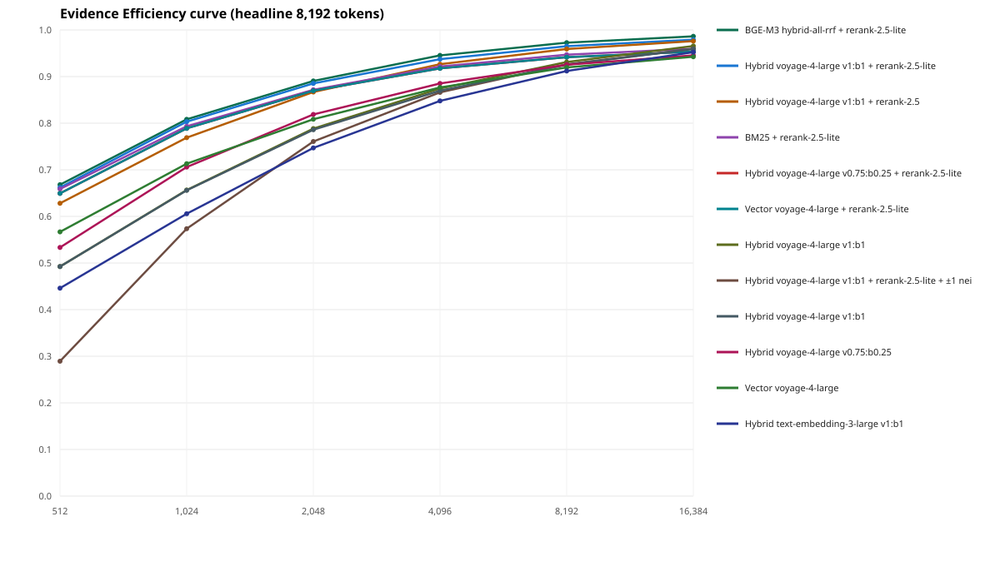

# Six-book within-book retrieval tournament

> Development result: the questions and evidence are provisional and unreviewed. Do not present these values as a locked benchmark.

- Cases: 145
- Headline: Evidence Efficiency @ 8,192 tokens
- Compatible completed runs: 7
- Metered API cost in compatible scoring runs: $0.288934
- Cumulative metered API cost in the run directory (including earlier artifact-building runs): $1.458082

## Headline leaderboard

| Rank | Chunking | Retrieval pipeline | EE | Payload EE | Recall | MRR | Tokens to first | Source run |
| ---: | --- | --- | ---: | ---: | ---: | ---: | ---: | --- |
| 1 | fixed-token-cl100k_base-256-32 | BGE-M3 hybrid-all-rrf + rerank-2.5-lite | 0.9727 | 0.9559 | 1.0000 | 0.8930 | 223.4 | six-book-bge-m3-rerank-lite-v2-f6ceb25df9ff35c7.json |
| 2 | fixed-token-cl100k_base-256-32 | Hybrid voyage-4-large v1:b1 + rerank-2.5-lite | 0.9652 | 0.9485 | 0.9931 | 0.8863 | 284.9 | six-book-context-expansion-v2-26916520d5144b6c.json |
| 3 | fixed-token-cl100k_base-256-32 | Hybrid voyage-4-large v1:b1 + rerank-2.5 | 0.9591 | 0.9423 | 0.9931 | 0.8514 | 334.8 | six-book-voyage-rerank-full-v2-ce251964e056f367.json |
| 4 | fixed-token-cl100k_base-256-32 | BM25 + rerank-2.5-lite | 0.9470 | 0.9306 | 0.9724 | 0.8780 | 434.4 | six-book-voyage-rerank-lite-v2-e8e57cf01724c10f.json |
| 5 | fixed-token-cl100k_base-256-32 | Hybrid voyage-4-large v0.75:b0.25 + rerank-2.5-lite | 0.9416 | 0.9253 | 0.9655 | 0.8671 | 478.6 | six-book-voyage-rerank-lite-v2-e8e57cf01724c10f.json |
| 6 | fixed-token-cl100k_base-256-32 | Vector voyage-4-large + rerank-2.5-lite | 0.9416 | 0.9253 | 0.9655 | 0.8671 | 478.6 | six-book-voyage-rerank-lite-v2-e8e57cf01724c10f.json |
| 7 | fixed-token-cl100k_base-256-32 | Hybrid voyage-4-large v1:b1 | 0.9312 | 0.9150 | 1.0000 | 0.7247 | 563.3 | six-book-text-retrieval-v2-7e926e58f70352fd.json |
| 8 | fixed-token-cl100k_base-256-32 | Hybrid voyage-4-large v1:b1 + rerank-2.5-lite + ±1 neighbor | 0.9264 | 0.9121 | 0.9931 | 0.5015 | 602.8 | six-book-context-expansion-v2-26916520d5144b6c.json |
| 9 | fixed-token-cl100k_base-256-32 | Hybrid voyage-4-large v1:b1 | 0.9254 | 0.9094 | 0.9931 | 0.7234 | 610.8 | six-book-weighted-hybrid-v2-ae6ccfcc34835be8.json |
| 10 | fixed-token-cl100k_base-256-32 | Hybrid voyage-4-large v0.75:b0.25 | 0.9254 | 0.9097 | 0.9655 | 0.7682 | 611.3 | six-book-weighted-hybrid-v2-ae6ccfcc34835be8.json |
| 11 | fixed-token-cl100k_base-256-32 | Vector voyage-4-large | 0.9196 | 0.9036 | 0.9655 | 0.7850 | 658.7 | six-book-text-retrieval-v2-7e926e58f70352fd.json |
| 12 | fixed-token-cl100k_base-256-32 | Hybrid text-embedding-3-large v1:b1 | 0.9120 | 0.8957 | 0.9862 | 0.6660 | 720.9 | six-book-text-retrieval-v2-7e926e58f70352fd.json |

## Cost ledger by run

| Run | Result cells | Metered API cost |
| --- | ---: | ---: |
| six-book-text-retrieval-v2 | 20,880 | $0.000000 |
| six-book-weighted-hybrid-v2 | 10,440 | $0.000000 |
| six-book-voyage-rerank-lite-v2 | 3,480 | $0.153980 |
| six-book-voyage-rerank-full-v2 | 870 | $0.096360 |
| six-book-local-retrieval-v2 | 5,220 | $0.000000 |
| six-book-context-expansion-v2 | 1,740 | $0.000000 |
| six-book-bge-m3-rerank-lite-v2 | 870 | $0.038594 |

Evidence Efficiency rewards finding all required evidence early within a token budget. Payload EE additionally penalizes unused/noisy context after the evidence. Recall and MRR remain visible so the composite score never hides basic retrieval behavior.

