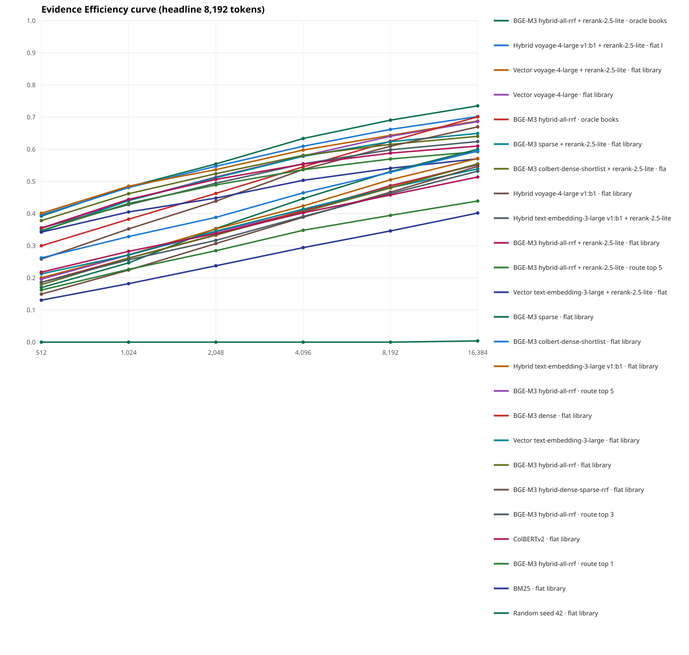

# Six-book library-wide retrieval tournament

> Development result: the questions and evidence are provisional and unreviewed. Do not present these values as a locked benchmark.

- Cases: 60
- Headline: Evidence Efficiency @ 8,192 tokens
- Compatible completed runs: 2
- Metered API cost in compatible scoring runs: $0.148757
- Cumulative metered API cost in the run directory (including earlier artifact-building runs): $1.458082

## Headline leaderboard

| Rank | Chunking | Retrieval pipeline | EE | Payload EE | Recall | MRR | Tokens to first | Source run |
| ---: | --- | --- | ---: | ---: | ---: | ---: | ---: | --- |
| 1 | fixed-token-cl100k_base-256-32 | BGE-M3 hybrid-all-rrf + rerank-2.5-lite · oracle books | 0.6906 | 0.6774 | 0.7583 | 0.5969 | 1934.7 | six-book-library-rerank-lite-v1-936f357b8a3a9f93.json |
| 2 | fixed-token-cl100k_base-256-32 | Hybrid voyage-4-large v1:b1 + rerank-2.5-lite · flat library | 0.6618 | 0.6490 | 0.7417 | 0.5849 | 2270.8 | six-book-library-rerank-lite-v1-936f357b8a3a9f93.json |
| 3 | fixed-token-cl100k_base-256-32 | Vector voyage-4-large + rerank-2.5-lite · flat library | 0.6432 | 0.6305 | 0.7250 | 0.5936 | 2372.4 | six-book-library-rerank-lite-v1-936f357b8a3a9f93.json |
| 4 | fixed-token-cl100k_base-256-32 | Vector voyage-4-large · flat library | 0.6404 | 0.6282 | 0.7250 | 0.5397 | 2316.4 | six-book-library-screen-v1-b295d3f6f8c25e1a.json |
| 5 | fixed-token-cl100k_base-256-32 | BGE-M3 hybrid-all-rrf · oracle books | 0.6250 | 0.6129 | 0.7583 | 0.4946 | 2521.1 | six-book-library-screen-v1-b295d3f6f8c25e1a.json |
| 6 | fixed-token-cl100k_base-256-32 | BGE-M3 sparse + rerank-2.5-lite · flat library | 0.6235 | 0.6119 | 0.6750 | 0.5334 | 2594.5 | six-book-library-rerank-lite-v1-936f357b8a3a9f93.json |
| 7 | fixed-token-cl100k_base-256-32 | BGE-M3 colbert-dense-shortlist + rerank-2.5-lite · flat library | 0.6152 | 0.6038 | 0.6500 | 0.5675 | 2529.6 | six-book-library-rerank-lite-v1-936f357b8a3a9f93.json |
| 8 | fixed-token-cl100k_base-256-32 | Hybrid voyage-4-large v1:b1 · flat library | 0.6094 | 0.5971 | 0.7083 | 0.4199 | 2794.6 | six-book-library-screen-v1-b295d3f6f8c25e1a.json |
| 9 | fixed-token-cl100k_base-256-32 | Hybrid text-embedding-3-large v1:b1 + rerank-2.5-lite · flat library | 0.5982 | 0.5865 | 0.6500 | 0.5215 | 2863.5 | six-book-library-rerank-lite-v1-936f357b8a3a9f93.json |
| 10 | fixed-token-cl100k_base-256-32 | BGE-M3 hybrid-all-rrf + rerank-2.5-lite · flat library | 0.5880 | 0.5771 | 0.6250 | 0.5360 | 2858.5 | six-book-library-rerank-lite-v1-936f357b8a3a9f93.json |
| 11 | fixed-token-cl100k_base-256-32 | BGE-M3 hybrid-all-rrf + rerank-2.5-lite · route top 5 | 0.5697 | 0.5590 | 0.6083 | 0.5279 | 3007.8 | six-book-library-rerank-lite-v1-936f357b8a3a9f93.json |
| 12 | fixed-token-cl100k_base-256-32 | Vector text-embedding-3-large + rerank-2.5-lite · flat library | 0.5409 | 0.5303 | 0.6000 | 0.4954 | 3234.3 | six-book-library-rerank-lite-v1-936f357b8a3a9f93.json |
| 13 | fixed-token-cl100k_base-256-32 | BGE-M3 sparse · flat library | 0.5306 | 0.5197 | 0.6583 | 0.3117 | 3570.7 | six-book-library-screen-v1-b295d3f6f8c25e1a.json |
| 14 | fixed-token-cl100k_base-256-32 | BGE-M3 colbert-dense-shortlist · flat library | 0.5285 | 0.5184 | 0.6083 | 0.3978 | 3451.4 | six-book-library-screen-v1-b295d3f6f8c25e1a.json |
| 15 | fixed-token-cl100k_base-256-32 | Hybrid text-embedding-3-large v1:b1 · flat library | 0.5052 | 0.4943 | 0.6083 | 0.3337 | 3677.5 | six-book-library-screen-v1-b295d3f6f8c25e1a.json |
| 16 | fixed-token-cl100k_base-256-32 | BGE-M3 hybrid-all-rrf · route top 5 | 0.4871 | 0.4773 | 0.6083 | 0.3427 | 3785.4 | six-book-library-screen-v1-b295d3f6f8c25e1a.json |
| 17 | fixed-token-cl100k_base-256-32 | BGE-M3 dense · flat library | 0.4855 | 0.4758 | 0.5917 | 0.3212 | 3741.7 | six-book-library-screen-v1-b295d3f6f8c25e1a.json |
| 18 | fixed-token-cl100k_base-256-32 | Vector text-embedding-3-large · flat library | 0.4805 | 0.4707 | 0.5750 | 0.3369 | 3849.4 | six-book-library-screen-v1-b295d3f6f8c25e1a.json |
| 19 | fixed-token-cl100k_base-256-32 | BGE-M3 hybrid-all-rrf · flat library | 0.4798 | 0.4698 | 0.6083 | 0.3185 | 3870.6 | six-book-library-screen-v1-b295d3f6f8c25e1a.json |
| 20 | fixed-token-cl100k_base-256-32 | BGE-M3 hybrid-dense-sparse-rrf · flat library | 0.4666 | 0.4572 | 0.5833 | 0.2808 | 4002.2 | six-book-library-screen-v1-b295d3f6f8c25e1a.json |
| 21 | fixed-token-cl100k_base-256-32 | BGE-M3 hybrid-all-rrf · route top 3 | 0.4619 | 0.4531 | 0.5667 | 0.3234 | 4098.4 | six-book-library-screen-v1-b295d3f6f8c25e1a.json |
| 22 | fixed-token-cl100k_base-256-32 | ColBERTv2 · flat library | 0.4577 | 0.4481 | 0.5333 | 0.3226 | 4289.0 | six-book-library-screen-v1-b295d3f6f8c25e1a.json |
| 23 | fixed-token-cl100k_base-256-32 | BGE-M3 hybrid-all-rrf · route top 1 | 0.3944 | 0.3877 | 0.4583 | 0.2825 | 4569.5 | six-book-library-screen-v1-b295d3f6f8c25e1a.json |
| 24 | fixed-token-cl100k_base-256-32 | BM25 · flat library | 0.3460 | 0.3389 | 0.4250 | 0.2117 | 5173.5 | six-book-library-screen-v1-b295d3f6f8c25e1a.json |
| 25 | fixed-token-cl100k_base-256-32 | Random seed 42 · flat library | 0.0000 | 0.0000 | 0.0000 | 0.0000 | 8192.0 | six-book-library-screen-v1-b295d3f6f8c25e1a.json |

## Performance by question type

### Attributed (24 cases)

| Rank | Retrieval pipeline | EE | Recall | MRR |
| ---: | --- | ---: | ---: | ---: |
| 1 | BGE-M3 hybrid-all-rrf + rerank-2.5-lite · oracle books | 0.8610 | 0.9167 | 0.6876 |
| 2 | Hybrid voyage-4-large v1:b1 + rerank-2.5-lite · flat library | 0.8359 | 0.8750 | 0.6869 |
| 3 | BGE-M3 colbert-dense-shortlist + rerank-2.5-lite · flat library | 0.8346 | 0.8750 | 0.6863 |
| 4 | Hybrid text-embedding-3-large v1:b1 + rerank-2.5-lite · flat library | 0.8314 | 0.8750 | 0.6771 |
| 5 | Vector voyage-4-large + rerank-2.5-lite · flat library | 0.7948 | 0.8333 | 0.6751 |

### Comparative (18 cases)

| Rank | Retrieval pipeline | EE | Recall | MRR |
| ---: | --- | ---: | ---: | ---: |
| 1 | BGE-M3 hybrid-all-rrf + rerank-2.5-lite · oracle books | 0.4074 | 0.5278 | 0.4168 |
| 2 | BGE-M3 sparse + rerank-2.5-lite · flat library | 0.3856 | 0.4722 | 0.3671 |
| 3 | BGE-M3 hybrid-all-rrf · oracle books | 0.3611 | 0.5833 | 0.3382 |
| 4 | BGE-M3 hybrid-all-rrf + rerank-2.5-lite · flat library | 0.3483 | 0.4167 | 0.3730 |
| 5 | BGE-M3 hybrid-all-rrf + rerank-2.5-lite · route top 5 | 0.3452 | 0.4167 | 0.4076 |

### Discovery (18 cases)

| Rank | Retrieval pipeline | EE | Recall | MRR |
| ---: | --- | ---: | ---: | ---: |
| 1 | Hybrid voyage-4-large v1:b1 + rerank-2.5-lite · flat library | 0.7693 | 0.8333 | 0.6874 |
| 2 | Vector voyage-4-large · flat library | 0.7541 | 0.8333 | 0.5790 |
| 3 | Vector voyage-4-large + rerank-2.5-lite · flat library | 0.7541 | 0.8333 | 0.6848 |
| 4 | BGE-M3 hybrid-all-rrf + rerank-2.5-lite · oracle books | 0.7466 | 0.7778 | 0.6561 |
| 5 | BGE-M3 sparse + rerank-2.5-lite · flat library | 0.7429 | 0.7778 | 0.6578 |

## Book-routing diagnostics

| Routing pipeline | Required-book recall | All required books | EE | Evidence recall |
| --- | ---: | ---: | ---: | ---: |
| BGE-M3 hybrid-all-rrf + rerank-2.5-lite · oracle books | 1.0000 | 1.0000 | 0.6906 | 0.7583 |
| BGE-M3 hybrid-all-rrf · oracle books | 1.0000 | 1.0000 | 0.6250 | 0.7583 |
| BGE-M3 hybrid-all-rrf + rerank-2.5-lite · route top 5 | 0.9833 | 0.9833 | 0.5697 | 0.6083 |
| BGE-M3 hybrid-all-rrf · route top 5 | 0.9833 | 0.9833 | 0.4871 | 0.6083 |
| BGE-M3 hybrid-all-rrf · route top 3 | 0.8750 | 0.8500 | 0.4619 | 0.5667 |
| BGE-M3 hybrid-all-rrf · route top 1 | 0.6000 | 0.4667 | 0.3944 | 0.4583 |

## Cost ledger by run

| Run | Result cells | Metered API cost |
| --- | ---: | ---: |
| six-book-library-screen-v1 | 5,760 | $0.000294 |
| six-book-library-rerank-lite-v1 | 3,240 | $0.148463 |

Evidence Efficiency rewards finding all required evidence early within a token budget. Payload EE additionally penalizes unused/noisy context after the evidence. Recall and MRR remain visible so the composite score never hides basic retrieval behavior.

